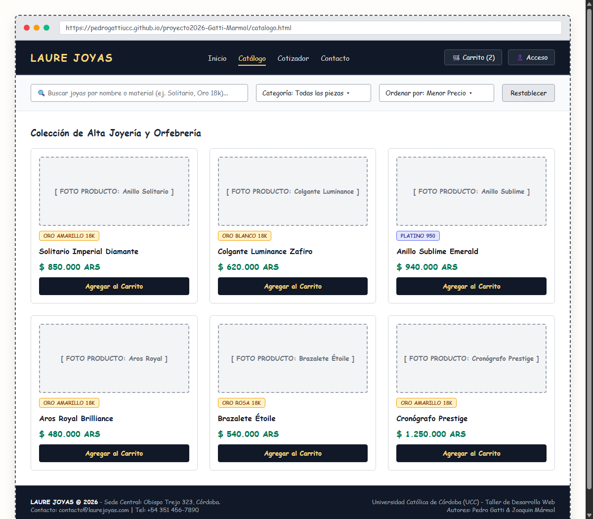
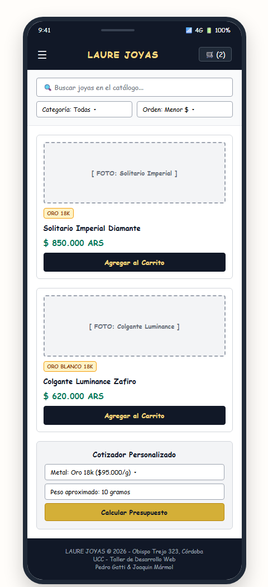

# Bocetos Iniciales (Sketch) - Laure Joyas

Prototipos en baja fidelidad y bocetos de diagramación inicial para **Laure Joyas**, cubriendo vistas de escritorio, vistas móviles y gestión de errores.

---

## Archivo Fuente
* **Diagrama de Bocetos:** [`sketch_laure_joyas.drawio`](sketch_laure_joyas.drawio)
* **Documento PDF Completo:** [`sketch_prototipo_completo.pdf`](sketch_prototipo_completo.pdf)

---

## 1. Boceto Desktop
* **Archivo de imagen:** [`sketch_desktop.png`](sketch_desktop.png)

---

## 2. Boceto Mobile
* **Archivo de imagen:** [`sketch_mobile.png`](sketch_mobile.png)

---

## 3. Mensajes de Error y Alertas para el Usuario
* **Archivo de imagen:** [`sketch_mensajes_error.png`](sketch_mensajes_error.png)

### Pautas Contempladas:
* Estructura general de navegación (header, navegación, grilla de productos y footer).
* Adaptación de columnas en pantalla reducida (mobile de 1 columna con menú colapsable).
* Mensajes de advertencia pedagógicos para campos vacíos o valores no permitidos.