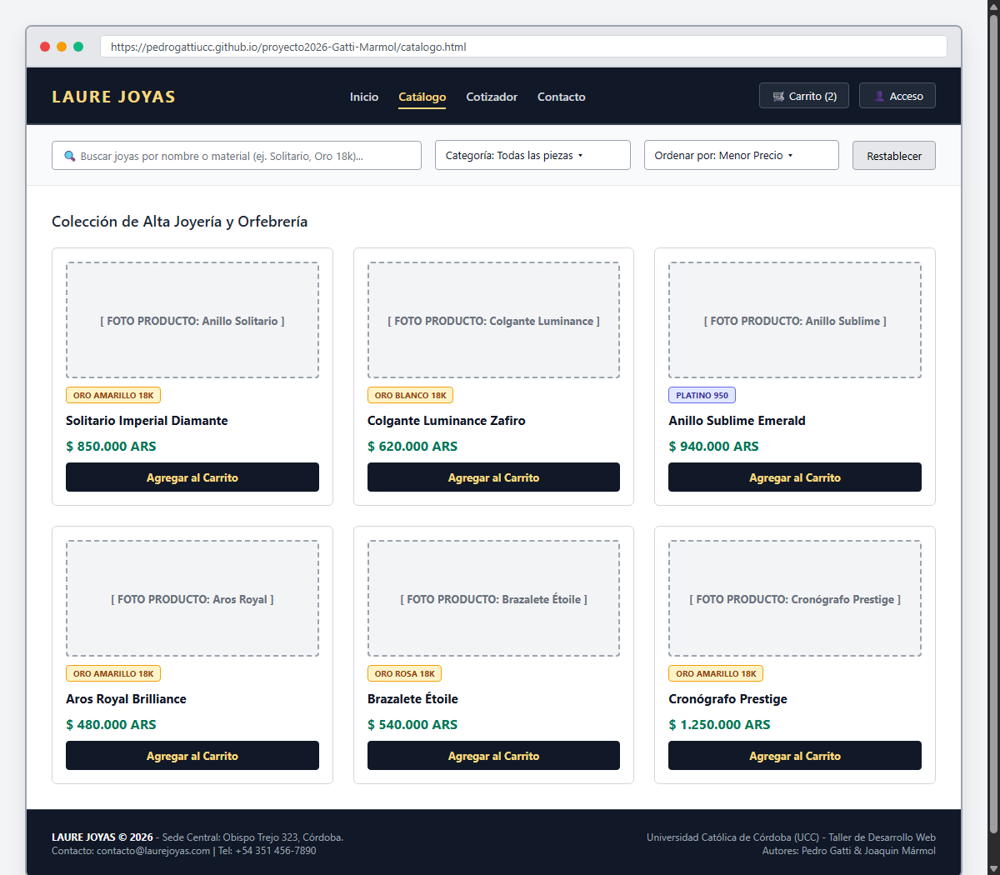
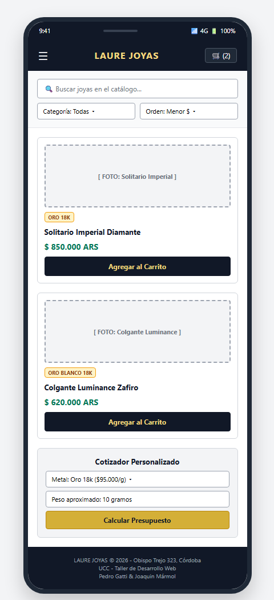
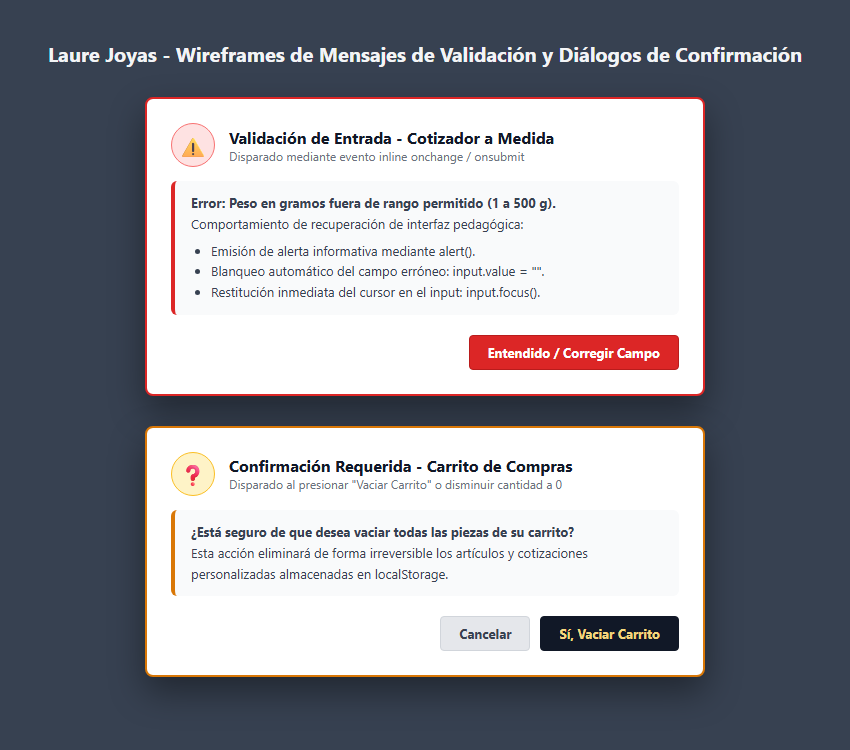

# Wireframes y Mockups Digitales - Laure Joyas

Prototipos digitales estructurados a color para la tienda **Laure Joyas**, diseñados en **Draw.io / diagrams.net** contemplando resoluciones Desktop, Mobile y estados de validación/error:

---

## Archivo Fuente
* **Diagrama Digital:** [`wireframes_laure_joyas.drawio`](wireframes_laure_joyas.drawio) (archivo editable en [diagrams.net](https://app.diagrams.net)).

---

## 1. Wireframe Desktop
* **Imagen:** [`wireframe_desktop.png`](wireframe_desktop.png)

---

## 2. Wireframe Mobile
* **Imagen:** [`wireframe_mobile.png`](wireframe_mobile.png)

---

## 3. Mensajes de Error y Diálogos de Validación
* **Imagen:** [`wireframe_mensajes_error.png`](wireframe_mensajes_error.png)

### Criterios Contemplados:
1. **Validación Pedagógica de Campos:** Alertas ante valores fuera de rango en el cotizador, blanqueo automático y restitución del foco (`.focus()`).
2. **Diálogos de Confirmación:** Advertencia preventiva antes de vaciar el carrito de compras.